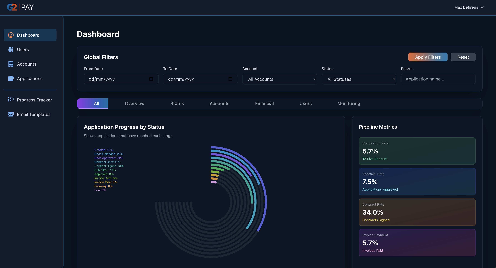
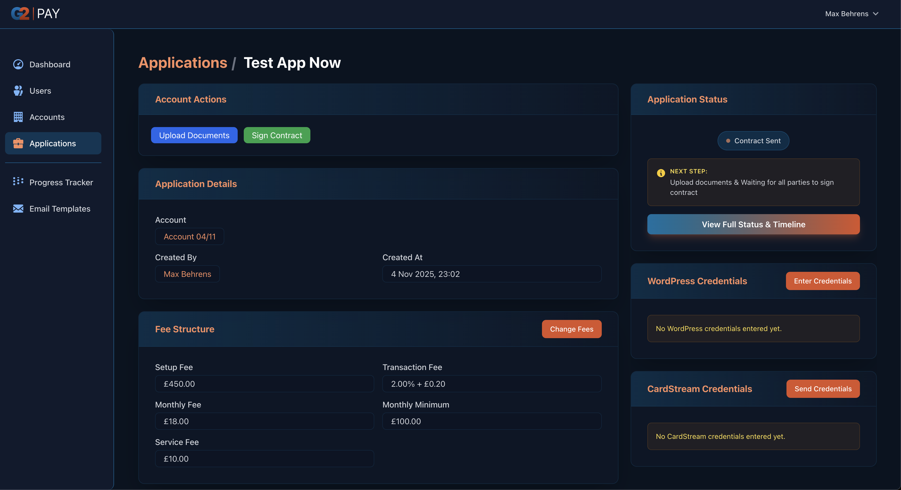
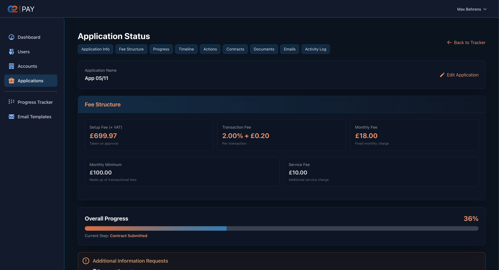
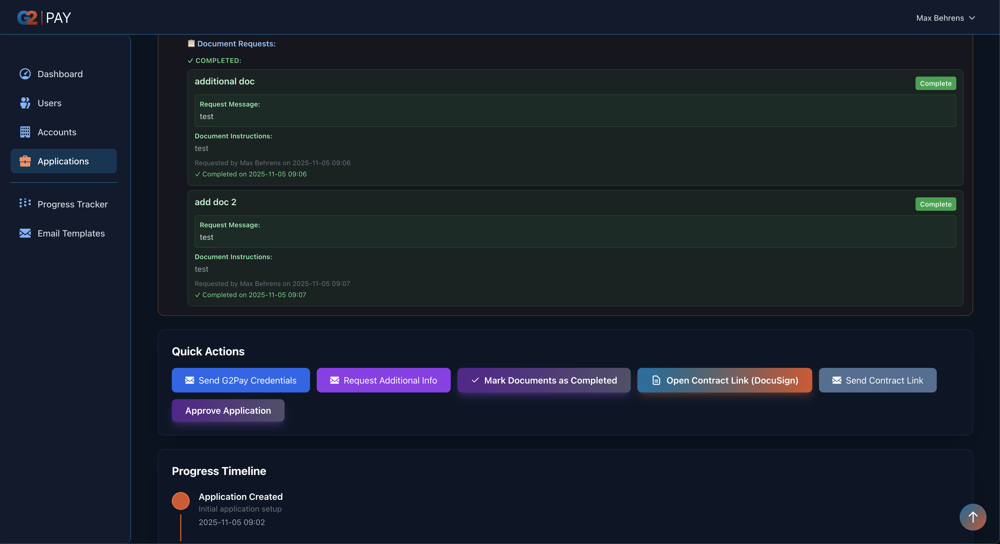
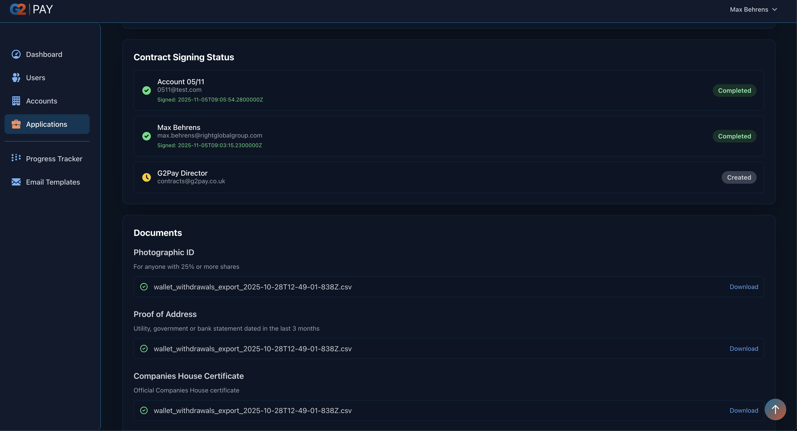
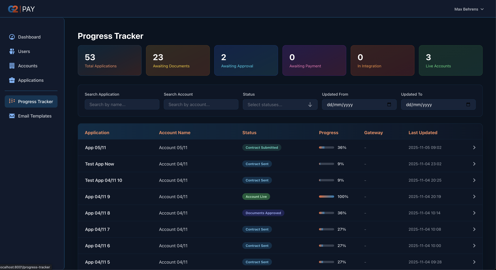
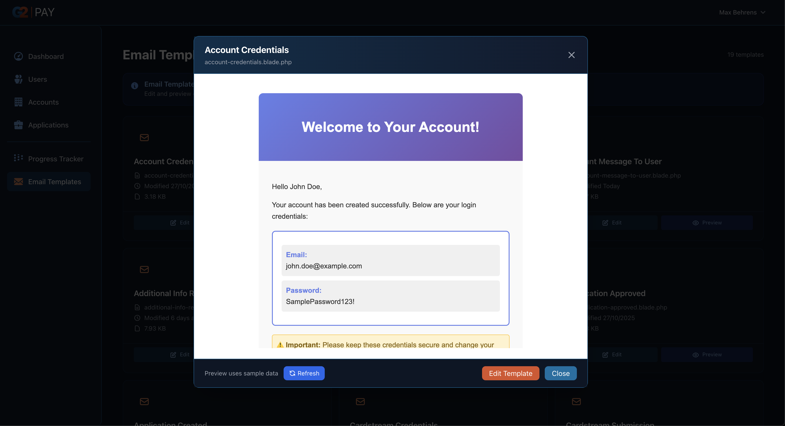

# G2Pay Application Portal

A Laravel-based merchant onboarding and application management system for payment gateway services.

## Overview

G2Pay Portal streamlines the merchant application process from initial signup through to live account activation, integrating with DocuSign for contract signing, Xero for invoicing, and CardStream for payment processing.

## Key Features

- **Dual Authentication System**: Separate login systems for administrators and merchant accounts
- **Application Management**: Complete lifecycle tracking from creation to live status
- **Document Management**: Secure upload and approval workflow for required documents
- **DocuSign Integration**: Automated contract generation and e-signature collection
- **Email Automation**: Scheduled reminders and notifications throughout the application process
- **Progress Tracking**: Visual dashboard showing application status across all stages
- **Fee Management**: Configurable pricing with setup fees, transaction rates, and monthly minimums

## Application Workflow

1. **Application Created** → Initial setup and fee configuration
2. **Contract Sent** → DocuSign contract distributed to merchant
3. **Documents Uploaded** → Merchant provides required documentation
4. **Documents Approved** → Admin reviews and approves submissions
5. **Contract Signed** → All parties complete DocuSign signing
6. **Contract Submitted** → Application forwarded to payment gateway
7. **Application Approved** → Admin approval granted
8. **Invoice Sent** → Setup fee invoice generated in Xero
9. **Invoice Paid** → Payment confirmation received
10. **Gateway Integrated** → CardStream credentials provided
11. **Account Live** → Merchant account activated

## Tech Stack

- **Backend**: Laravel 10, PHP 8.2
- **Frontend**: Vue 3, Inertia.js, Tailwind CSS
- **Database**: MySQL
- **Integrations**: DocuSign API, TODO: Xero API, CardStream API


## Installation
```bash
# Clone repository
git clone 

# Install dependencies
composer install
npm install

# Configure environment
cp .env.example .env
php artisan key:generate

# Run migrations
php artisan migrate

# Build assets
npm run build

# Start development server
php artisan serve

# Mail env constants currently use mailhog.
```


## Screenshots

### Dashboard Overview

*Main dashboard showing application statistics and status distribution*

### Applications List

*View and manage all merchant applications with filtering options*

### Application Status Tracking

*Detailed timeline view showing progress through each stage*

### Progress Tracker

*Visual dashboard tracking all applications across workflow stages*

### Document Management

*Secure document upload and approval workflow*

### Email Template Editor

*Customize automated email templates for each workflow stage*

### User Management

*Admin panel for managing users and permissions*

---

## Application Workflow Visualization

```mermaid
graph LR
    A[Created] --> B[Contract Sent]
    B --> C[Documents Uploaded]
    C --> D[Documents Approved]
    D --> E[Contract Signed]
    E --> F[Submitted]
    F --> G[Approved]
    G --> H[Invoice Sent]
    H --> I[Invoice Paid]
    I --> J[Gateway Integrated]
    J --> K[Account Live]
```

